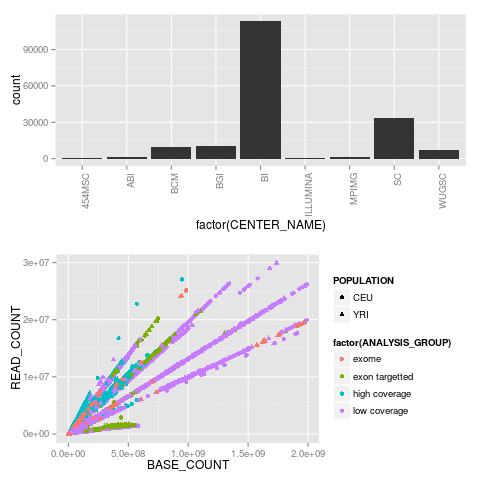
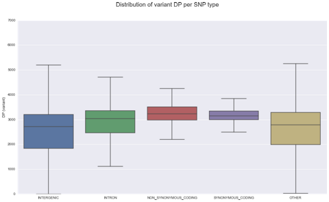
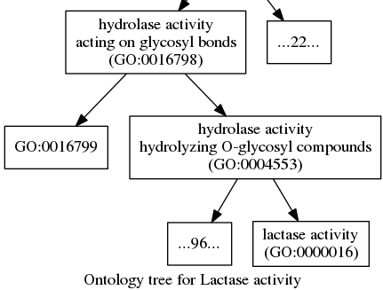
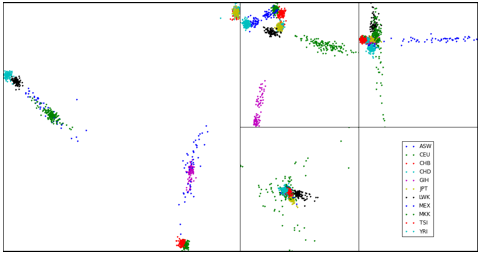
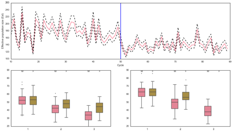
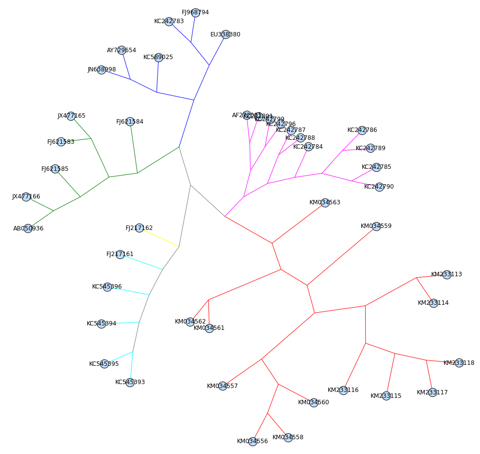
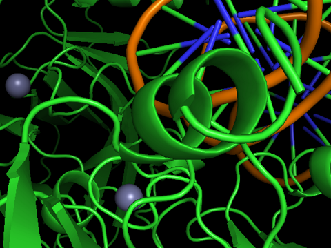
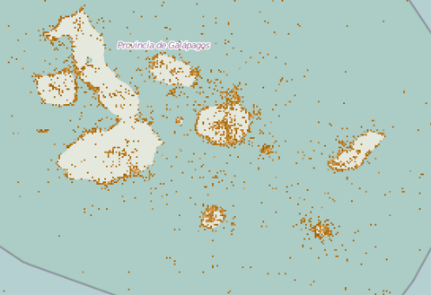

# 파이썬을 활용한 생물정보학 쿡북 (Bioinformatics with Python Cookbook) {.unnumbered}

이 웹사이트는 Packt에서 출판된 **"파이썬을 활용한 생물정보학 쿡북 (Bioinformatics with Python Cookbook, Second Edition)"**의 상호작용형 Quarto 북 버전입니다.

생물정보학은 기초부터 고등 연산 기술에 이르는 다양한 방법을 통해 생물학적 데이터에서 가치 있는 정보를 추출하는 활발한 연구 분야입니다. 이 책에서는 차세대 서열 분석(NGS), 유전체학(Genomics), 메타게놈(Metagenomics), 집단 유전학(Population Genetics), 계통학(Phylogenetics), 그리고 단백질체학(Proteomics)을 중점적으로 다룹니다.

## 저자 소개

**Tiago Antao**는 유전체학 분야에서 활동 중인 생물정보학자입니다. 파이썬의 주요 생물정보학 패키지인 Biopython의 공동 개발자 중 한 명이며, 케임브리지 대학교, 옥스퍼드 대학교, 몬태나 대학교에서 연구 활동을 수행했습니다.

## 주요 특징

* 대규모 차세대 서열 분석(NGS) 데이터셋 처리 방법 습득
* FASTQ, BAM, VCF 형식을 사용한 유전체 데이터 분석
* 서열 비교 및 계통 발생 재구성 수행
* 복잡한 단백질체 데이터 분석
* 파이썬을 활용한 Galaxy 서버와의 상호작용

---

## 데이터셋 (Datasets)

책에서 사용되는 데이터셋 링크입니다.

**중요 참고 사항:**

1. 이 데이터셋들은 제3자가 운영하는 외부 서버에서 제공됩니다.
2. 보안상의 이유로 FTP 링크는 클릭 가능한 URL로 제공되지 않을 수 있습니다. 링크를 복사하여 브라우저 주소창이나 FTP 클라이언트에 붙여넣어 사용하세요.

### 1. 파이썬 생태계와 R 연동

*   **[sequence.index](ftp://ftp.1000genomes.ebi.ac.uk/vol1/ftp/historical_data/former_toplevel/sequence.index)** (1000 Genomes 프로젝트)

### 2. 차세대 서열 분석 (NGS)

*   **[SRR003265.filt.fastq.gz](ftp://ftp.1000genomes.ebi.ac.uk/vol1/ftp/phase3/data/NA18489/sequence_read/SRR003265.filt.fastq.gz)** (FASTQ 형식)
*   **[NA18490_20_exome.bam](ftp://ftp.1000genomes.ebi.ac.uk/vol1/ftp/phase3/data/NA18489/exome_alignment/NA18489.chrom20.ILLUMINA.bwa.YRI.exome.20121211.bam)** (BAM 형식)
*   **[NA18490_20_exome.bam.bai](ftp://ftp.1000genomes.ebi.ac.uk/vol1/ftp/phase3/data/NA18489/exome_alignment/NA18489.chrom20.ILLUMINA.bwa.YRI.exome.20121211.bam.bai)** (BAM 인덱스)
*   **[ALL.chr22.phase3...genotypes.vcf.gz](ftp://ftp-trace.ncbi.nih.gov/1000genomes/ftp/release/20130502/supporting/vcf_with_sample_level_annotation/ALL.chr22.phase3_shapeit2_mvncall_integrated_v5_extra_anno.20130502.genotypes.vcf.gz)** (VCF 형식)

### 3. 유전체학 (Genomics)

*   **[falciparum.fasta](http://plasmodb.org/common/downloads/release-9.3/Pfalciparum3D7/fasta/data/PlasmoDB-9.3_Pfalciparum3D7_Genome.fasta)** (열대열 말라리아 원충 참조 유전체)
*   **[gambiae.fa.gz](ftp://ftp.vectorbase.org/public_data/organism_data/agambiae/Genome/agambiae.CHROMOSOMES-PEST.AgamP3.fa.gz)** (아노펠레스 모기 참조 유전체)
*   **[atroparvus.fa.gz](https://www.vectorbase.org/download/anopheles-atroparvus-ebroscaffoldsaatre1fagz)**
*   **[gambiae.gff3.gz](http://www.vectorbase.org/download/anopheles-gambiae-pestbasefeaturesagamp42gff3gz)** (유전체 주석 데이터)

### 4. 집단 유전학 (PopGen)

*   **[hapmap.map.bz2](http://hapmap.ncbi.nlm.nih.gov/downloads/genotypes/hapmap3/plink_format/draft_2/hapmap3_r2_b36_fwd.consensus.qc.poly.map.bz2)**
*   **[hapmap.ped.bz2](http://hapmap.ncbi.nlm.nih.gov/downloads/genotypes/hapmap3/plink_format/draft_2/hapmap3_r2_b36_fwd.consensus.qc.poly.ped.bz2)**
*   **[relationships.txt](http://hapmap.ncbi.nlm.nih.gov/downloads/genotypes/hapmap3/plink_format/draft_2/relationships_w_pops_121708.txt)**

### 5. 단백질 구조 (PDB)

*   **[1TUP.cif](http://www.rcsb.org/pdb/download/downloadFile.do?fileFormat=cif&compression=NO&structureId=1TUP)** (P53 단백질 구조)

### 6. 대규모 데이터를 위한 파이썬 (HPC)

*   **[SRR003265_1.filt.fastq.gz](ftp://ftp.1000genomes.ebi.ac.uk/vol1/ftp/phase3/data/NA18489/sequence_read/SRR003265_1.filt.fastq.gz)** (Pair-end 1)
*   **[SRR003265_2.filt.fastq.gz](ftp://ftp.1000genomes.ebi.ac.uk/vol1/ftp/phase3/data/NA18489/sequence_read/SRR003265_2.filt.fastq.gz)** (Pair-end 2)
*   **[Germline 공유 염색체 세그먼트 데이터](ftp://ftp.1000genomes.ebi.ac.uk/vol1/ftp/phase1/analysis_results/shapeit2_phased_haplotypes/)**

:::{.callout-note}
**GitHub 사용자 참고 사항**: GitHub에서 이 내용을 보고 계신다면, 노트북이 올바르게 렌더링되도록 브라우저의 현재 탭에서 노트북 파일을 열어주시기 바랍니다.
:::

---

## 장별 개요 (Chapters Overview)

### Chapter 1: R과 연동하기

파이썬과 R의 장점을 결합하여 생물학적 데이터를 분석합니다.

*   [R 인터페이싱 (rpy2)](Chapter01/Interfacing_R.ipynb)
*   [R 매직 커맨드 활용](Chapter01/R_magic.ipynb)

### Chapter 2: 차세대 서열 분석 (NGS)

대규모 서열 데이터를 효율적으로 처리하고 분석합니다.

*   [FASTQ 데이터 처리](Chapter02/Working_with_FASTQ.ipynb)
*   [BAM 및 정렬 데이터 분석](Chapter02/Working_with_BAM.ipynb)
*   [VCF 변이 분석](Chapter02/Working_with_VCF.ipynb)
*   [SNP 필터링 및 품질 관리](Chapter02/Filtering_SNPs.ipynb)
*   [HTSeq 활용 (BED 처리)](Chapter02/Processing_BED_with_HTSeq.ipynb)
*   [DB 접근 및 서열 처리 기초](Chapter02/Accessing_Databases.ipynb)

### Chapter 3: 유전체학 (Genomics)

참조 유전체와 주석 데이터를 활용하여 유전자 정보를 추출합니다.

*   [참조 유전체 활용](Chapter03/Reference_Genome.ipynb)
*   [유전자 정보 추출](Chapter03/Getting_Gene.ipynb)
*   [유전체 주석 탐색](Chapter03/Annotations.ipynb)
*   [유전자 온톨로지(GO) 분석](Chapter03/Gene_Ontology.ipynb)
*   [저품질 참조 유전체 처리](Chapter03/Low_Quality.ipynb)
*   [상동성(Orthology) 분석](Chapter03/Orthology.ipynb)

### Chapter 4: 집단 유전학 (Population Genetics)

집단 간의 유전적 차이와 구조를 분석합니다.

*   [데이터 포맷 (PLINK)](Chapter04/Data_Formats.ipynb)
*   [Genepop 데이터 포맷](Chapter04/Genepop_Format.ipynb)
*   [탐색적 데이터 분석 (EDA)](Chapter04/Exploratory_Analysis.ipynb)
*   [F-statistics 분석](Chapter04/F-stats.ipynb)
*   [주성분 분석 (PCA)](Chapter04/PCA.ipynb)
*   [혼합(Admixture) 분석](Chapter04/Admixture.ipynb)

### Chapter 5: 집단 유전학 시뮬레이션

simuPOP을 이용하여 유전적 시나리오를 시뮬레이션합니다.

*   [simuPOP 기초](Chapter05/Basic_SimuPOP.ipynb)
*   [집단 구조 모델링](Chapter05/Pop_Structure.ipynb)
*   [선택압(Selection) 시뮬레이션](Chapter05/Selection.ipynb)
*   [복잡한 시나리오 모델링](Chapter05/Complex.ipynb)

### Chapter 6: 계통학 (Phylogenetics)

종 간의 진화적 관계를 규명하고 시각화합니다.

*   [데이터 탐색 및 전처리](Chapter06/Exploration.ipynb)
*   [서열 정렬 (Alignment)](Chapter06/Alignment.ipynb)
*   [서열 비교 분석](Chapter06/Comparison.ipynb)
*   [계통 나무 재구성](Chapter06/Reconstruction.ipynb)
*   [나무 구조 분석](Chapter06/Trees.ipynb)
*   [계통 시각화](Chapter06/Visualization.ipynb)
*   [진화적 선택 분석](Chapter06/Selection.ipynb)

### Chapter 7: 단백질체학 (Proteomics)

단백질 구조 데이터를 파싱하고 기하학적으로 분석합니다.

*   [단백질 구조 DB 접근](Chapter07/Intro.ipynb)
*   [PDB 파서 구현](Chapter07/Parser.ipynb)
*   [구조 통계 분석](Chapter07/Stats.ipynb)
*   [Bio.PDB 활용 기초](Chapter07/PDB.ipynb)
*   [mmCIF 파일 파싱](Chapter07/mmCIF.ipynb)
*   [원자 간 거리 계산](Chapter07/Distance.ipynb)
*   [기하학적 연산 (질량 중심)](Chapter07/Mass.ipynb)

### Chapter 9: 고성능 연산 (HPC)

대규모 데이터를 빠르게 처리하기 위한 최적화 기술입니다.

*   [Cython 및 Numba 최적화](Chapter09/Cython_Numba.ipynb)
*   [Dask 병렬 처리](Chapter09/Dask.ipynb)
*   [HDF5 데이터 활용](Chapter09/HDF5.ipynb)
*   [Parquet 포맷 활용](Chapter09/Parquet.ipynb)
*   [Apache Spark 활용](Chapter09/Spark.ipynb)

### Chapter 10: 기타 주제

네트워크 분석, 생물다양성 데이터 및 메타게놈 분석을 다룹니다.

*   [Cytoscape 네트워크 시각화](Chapter10/Cytoscape.ipynb)
*   [GBIF 생물다양성 데이터](Chapter10/GBIF.ipynb)
*   [GBIF 데이터 지오레퍼런싱](Chapter10/GBIF_extra.ipynb)
*   [Germline 공유 세그먼트 분석](Chapter10/Germline.ipynb)
*   [QIIME2 메타게놈 분석](Chapter10/QIIME2_Metagenomics.ipynb)

### Chapter 11: 머신러닝

생물학적 데이터에 머신러닝 모델을 적용합니다.

*   [데이터 준비 (2L)](Chapter11/Preparation.ipynb)
*   [데이터 탐색](Chapter11/Exploration.ipynb)
*   [멘델 유전 시뮬레이션 활용](Chapter11/Mendel.ipynb)
*   [특징량 추출 (ML Prep)](Chapter11/ML_Preparation.ipynb)
*   [SVM 모델 학습 및 피팅](Chapter11/SVM_Train.ipynb)
*   [의사결정 나무 분석](Chapter11/Decision_Trees.ipynb)
